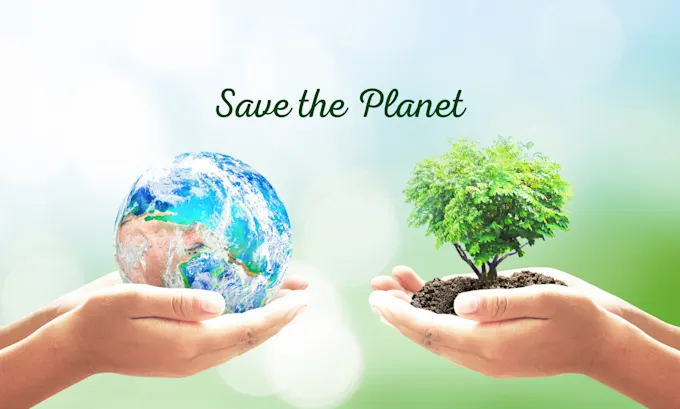
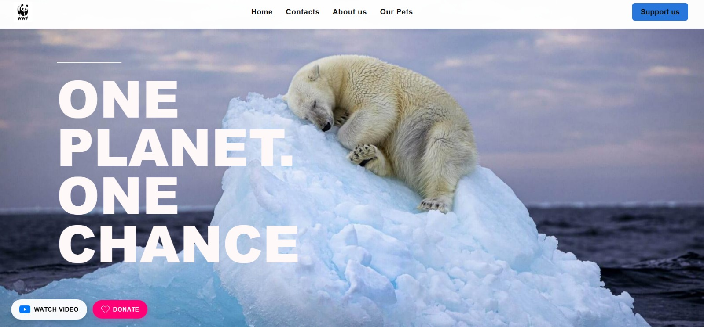
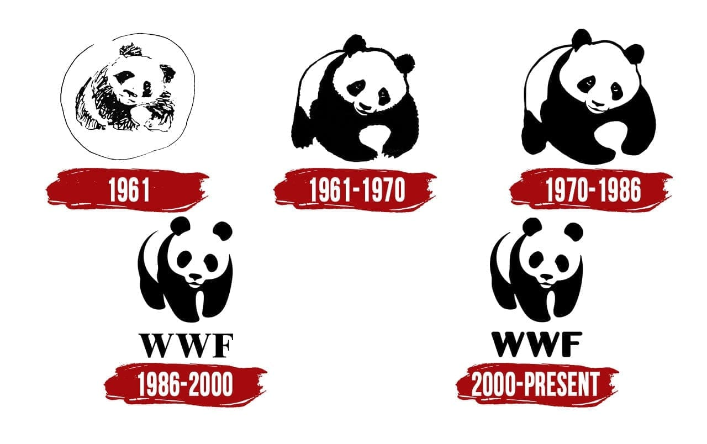
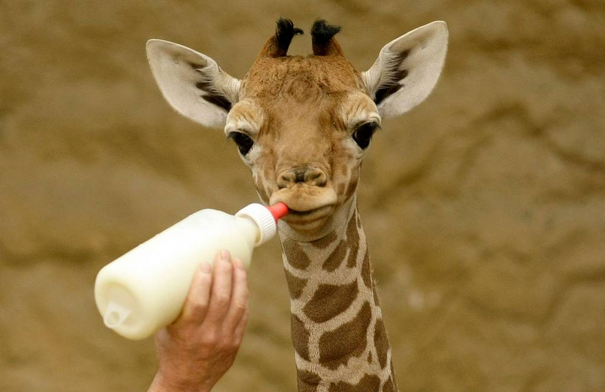
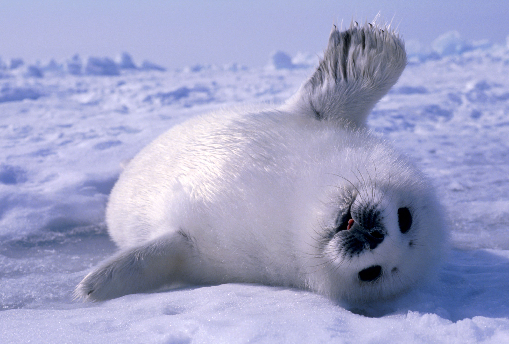
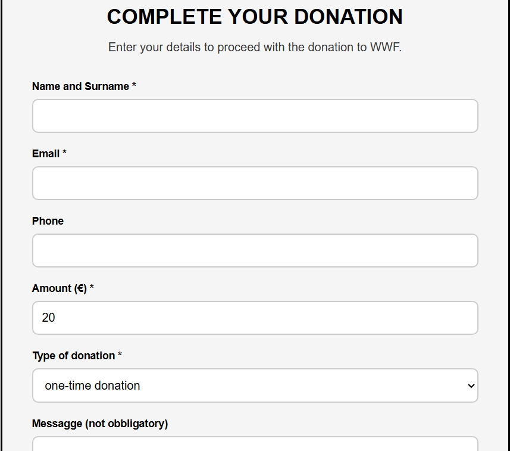
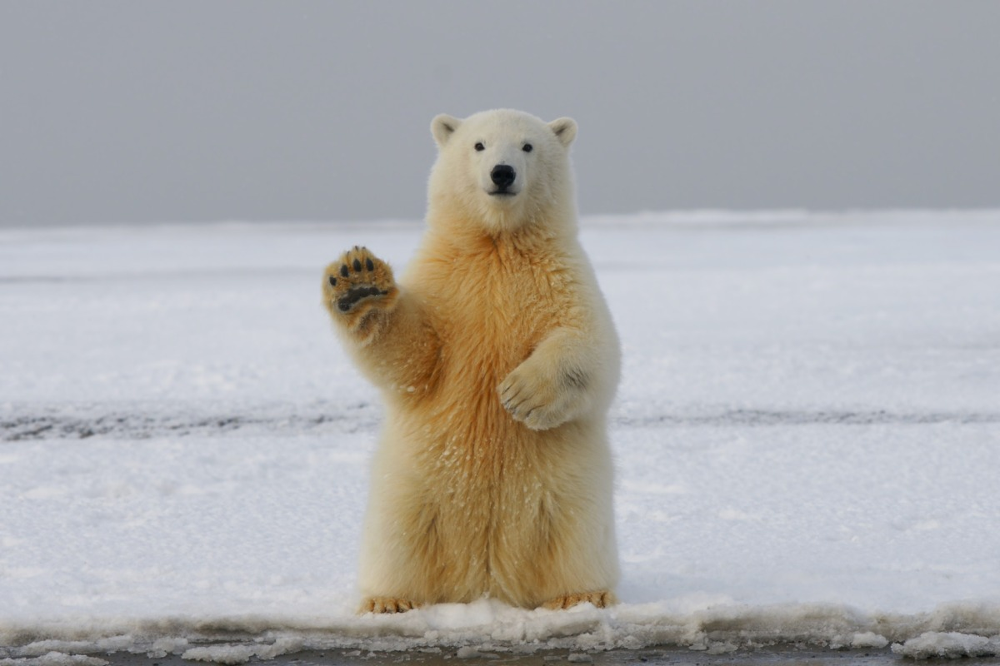

## Pitch Presentation
Welcome!

This presentation illustrates the redesign of a WWF website for the Web Communication exam.

**Goal:** Effectively communicate the mission and features of the new site.

---



“One planet. One chance.”  
Think about our world and future!

### Web Communication Exam

---

## File Structure
```
esame web/
├── index.html
├── about us.html
├── contacts.html
├── support us.html
├── our pets.html
├── style.css (2049 lines)
├── javascript.js (247 lines)
└── imgs/
    └── (16 images)
```

---

## Project Overview
A complete WWF conservation website with 5 pages:
- Home
- About Us
- Contacts
- Support Us
- Our Pets

Built with HTML5, CSS3, and JavaScript

---

## Technical Features
- **HTML5**
  - Semantic markup; Consistent naming conventions; Commented sections
- **CSS3**
  - Modern styling with animations; Organized by page sections
- **JavaScript**
  - Interactive functions; Centralized in one file

---

## Page Structure
### 1. Homepage (index.html)
- Hero section with background image
- Floating action buttons (Video, Donate)
- Cookie banner
- Navigation menu

---

## User Experience


Example of a simplified and intuitive layout.

A simplified home section in which a user can easily navigate and find key information

---

## Page Structure
### 2. About Us
- Mission statement section
- Interactive history timeline slider
- Our values grid
- Video link section
- Newsletter signup

---

## We are WWF


Join in our family!

A small piece of our heart to know more about us, who we are, what we do, our story.

---

## Page Structure
### 3. Contacts
- Contact form with validation
- Social media links with SVG icons
- Location information
- reCAPTCHA integration

---

## Page Structure
### 5. Our Pets
- Ken Burns effect slideshow
- Pet cards grid (6 animals)
- Interactive modals with animal info
- Plush toy shop with cart system

---

## Help with just one click





Meet some adoptable pets.

---

## Page Structure
### 4. Support Us
- Three donation options (one-time, monthly, adoption)
- Impact cards showing conservation work
- Donation form
- Other ways to help section

---

## Remember, if you want, you can!


---

## Design Choices
### Color Scheme
- White backgrounds (#ffffff)
- Light blue accents (#e3f2fd)
- Blue buttons (#0077ff, #2776dc)
- Green background shadows rgba(50, 255, 173, 0.9)
- Black text (#000000)
- Clean, modern aesthetic

---

## Technologies Summary
| Technology   | Usage                |
| ------------|----------------------|
| HTML5       | Structure & content  |
| CSS3        | Styling & animations |
| JavaScript  | Interactivity        |
| SVG         | Icons & graphics     |
| localStorage| Cookie preferences   |

---

## Conclusion
A complete, functional wildlife conservation website demonstrating:
- Multi-page structure
- Interactive features
- Modern design
- Clean code organization
- User-friendly interface

---

## Thank You!


**Project by:** Maria Antonietta Caschera  
**Course:** Web Communication  
**Year:** 2025/2026
